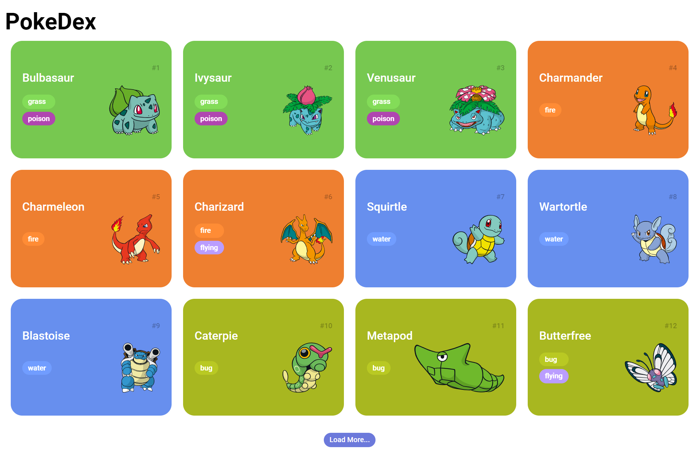

# PokeDex

## 💻 Projeto

Mini Portifólio com centralizador de links.

## 🚀 Tecnologias

- JS
- HTML
- CSS
- Git e GitHub

## 🔍 Sobre o Projeto

O projeto tem como finalidade listar Pokemons pelos seus detalhes como tipo, nome e poder. A listagem é feita a partir do consumo de API, que fornece as informações referentes a cada Pokemon.

## 📧 Contato

- Email: mathtg2@gmail.com
- LinkedIn: https://www.linkedin.com/in/matheus-patrickz/
